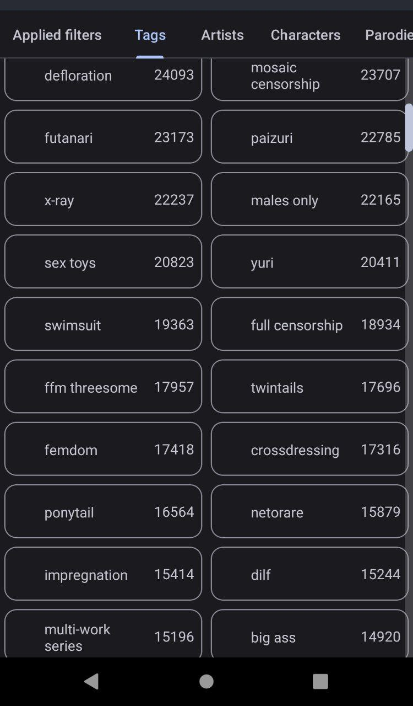
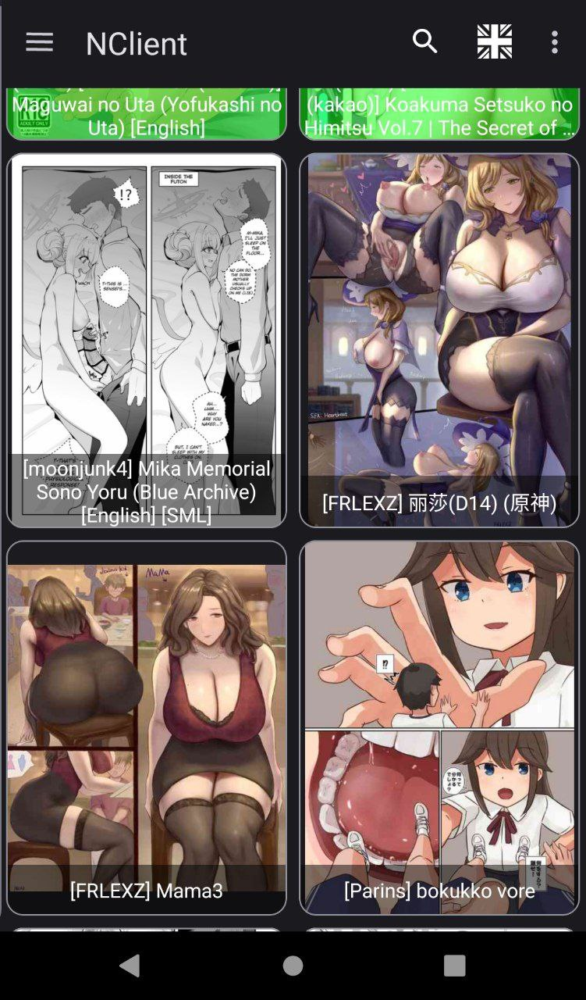
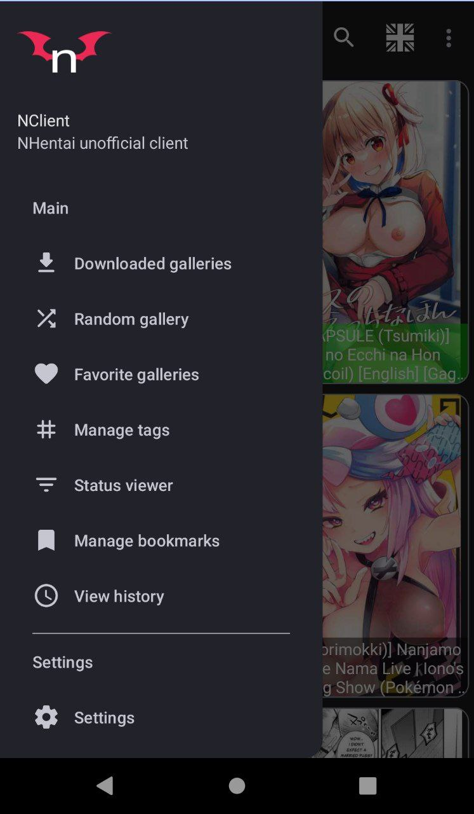
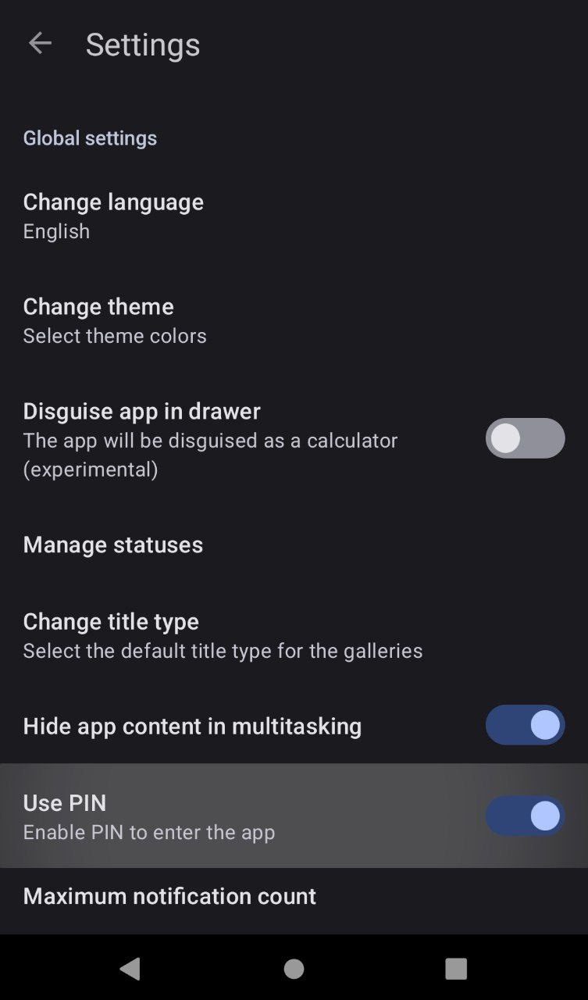

# NClient

Dublikunt Max app to see nhentai.net website from modern android app written on java.

## Features

- [x] Nhentai API
- [x] Material design
- [x] 2 themes
- [x] Multi language interface
- [x] Hide icon from launcher
- [x] Tag sorting
- [x] Authors sorting
- [x] Servicing engine
- [x] Fast image loading
- [x] Password for app
- [x] Download gallery's
- [x] Export to ZIP or PDF
- [x] Cashing images for offline view
- [x] History
- [x] Bookmarks
- [x] Favorites
- [x] Account syncing

## Screenshots

|||
:- | :- | :- | :-

## Roadmap

### Currently

- Add icons
- Use only matrilineal design
- Remove all compilation warnings

### Future

- Add others site support
